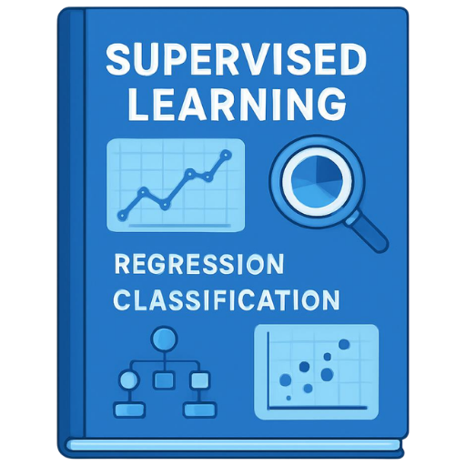

# Supervised_Learning




This repository contains the notes and the work(lab work & self exercises) done for Supervised Learning. The notes are used to help others and you can also see the work code. Warning: the code is not for copy-paste but for reference.

## Contents

- The lecture notes
- The lab work
- The self exercises
- The practice files

## Getting Started

1. Clone the repository:

   ```bash
   git clone https://github.com/Prath-Digital/Supervised_Learning.git
   ```

2. Navigate to the directory:

   ```bash
   cd Supervised_Learning
   ```

## Requirements

- Python 3.10(recommended & what I use) or higher
- Jupyter Notebook or Jupyter Lab
- Required libraries (can be installed via pip):

  ```bash
  pip install (library_name) (library2_name)...
  ```

## Lab Work and Self Excercises progress

- Work of 1.1 is completed and available in the [`Work/ch_1/lec_1.1`](./Work/ch_1/lec_1.1) directory.
- Work of 1.2 is completed and available in the [`Work/ch_1/lec_1.2`](./Work/ch_1/lec_1.2) directory.
- Work of 2.1 is completed and available in the [`Work/ch_2/lec_2.1`](./Work/ch_2/lec_2.1) directory.
- Work of 2.2 is completed and available in the [`Work/ch_2/lec_2.2`](./Work/ch_2/lec_2.2) directory.
- Work of 2.3 is completed and available in the [`Work/ch_2/lec_2.3`](./Work/ch_2/lec_2.3) directory.
- Work of 2.4 is completed and available in the [`Work/ch_2/lec_2.4`](./Work/ch_2/lec_2.4) directory.
- Work of 2.5 is completed and available in the [`Work/ch_2/lec_2.5`](./Work/ch_2/lec_2.5) directory.
- Work of 2.6 is completed and available in the [`Work/ch_2/lec_2.6`](./Work/ch_2/lec_2.6) directory.
- Work of 2.7 is completed and available in the [`Work/ch_2/lec_2.7`](./Work/ch_2/lec_2.7) directory.
- Work of 2.8 is in progress and will be available in the `Work/ch_2/lec_2.8` directory once completed.

## Lecture Notes

The lecture notes are organized by chapter and lecture. You can find them in the [`notes`](./notes) directory.
- Notes of 1.1 are completed and available in the [`notes/lec_1.1.md`](./notes/lec_1.1.md).
- Notes of 1.2 are completed and available in the [`notes/lec_1.2.md`](./notes/lec_1.2.md).
- Notes of 2.1 are completed and available in the [`notes/lec_2.1.md`](./notes/lec_2.1.md).
- Notes of 2.2 are completed and available in the [`notes/lec_2.2.md`](./notes/lec_2.2.md).
- Notes of 2.3 are completed and available in the [`notes/lec_2.3.md`](./notes/lec_2.3.md) and [`notes/lec_2.3 part 2.md`](./notes/lec_2.3_part-2.md).
- Notes of 2.4 and 2.5 are completed and available in the [`notes/lec_2.4&2.5.md`](./notes/lec_2.4&2.5.md).
- Notes of 2.6 are completed and available in the [`notes/lec_2.6.png`](./notes/lec_2.6.png).
- Notes of 2.7 are completed and available in the [`notes/lec_2.7.png`](./notes/lec_2.7.png).
- Notes of 2.8 are in progress and will be available in the `notes/lec_2.8.md` once completed.

## Practice files

- Practice File of 1.1 is not available because that lecture does not have any practice files.
- Practice File of 1.2 is completed and available in the [`Practice-files/lec_1.2.ipynb`](./Practice-files/lec_1.2.ipynb).
- Practice File of 2.1 is not available because that lecture does not have any practice files.
- Practice File of 2.2 is completed and available in the [`Practice-files/lec_2.2.xlsx`](./Practice-files/lec_2.2.xlsx).
- Practice Files of 2.3 is completed and available in the [`Practice-files/lec_2.3/`](./Practice-files/lec_2.3/).
- Practice Files of 2.4 & 2.5 is completed and available in the [`Practice-files/lec_2.4&2.5.ipynb`](./Practice-files/lec_2.4&2.5.ipynb).
- Practice Files of 2.6 is completed and available in the [`Practice-files/lec_2.6/`](./Practice-files/lec_2.6/).
- Practice Files of 2.7 is completed and available in the [`Practice-files/lec_2.7.ipynb`](./Practice-files/lec_2.7.ipynb).
- Practice File of 2.8 is in progress and will be available in the `Practice-files/lec_2.8.ipynb` once completed.

## License

This project is licensed under the MIT License - see the [`LICENSE`](LICENSE) file for details.
