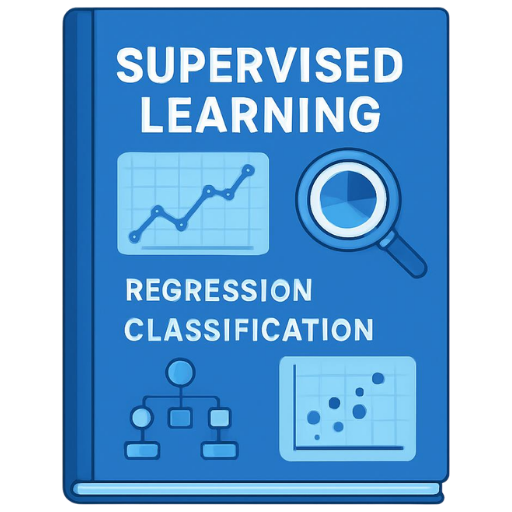

# Supervised_Learning




This repository contains the notes and the work(lab work & self exercises) done for Supervised Learning. The notes are used to help others and you can also see the work code. Warning: the code is not for copy-paste but for reference.

## Contents

- The lecture notes
- The lab work
- The self exercises
- The practice files

## Getting Started

1. Clone the repository:

   ```bash
   git clone https://github.com/Prath-Digital/Supervised_Learning.git
   ```

2. Navigate to the directory:

   ```bash
   cd Supervised_Learning
   ```

## Requirements

- Python 3.10(recommended & what I use) or higher
- Jupyter Notebook or Jupyter Lab
- Required libraries (can be installed via pip):

  ```bash
  pip install (library_name) (library2_name)...
  ```

## Lab Work and Self Excercises progress

- Work of 1.1 is completed and available in the [`Work/ch_1/lec_1.1`](./Work/ch_1/lec_1.1) directory.
- Work of 1.2 is completed and available in the [`Work/ch_1/lec_1.2`](./Work/ch_1/lec_1.2) directory.
- Work of 2.1 is completed and available in the [`Work/ch_2/lec_2.1`](./Work/ch_2/lec_2.1) directory.
- Work of 2.2 is completed and available in the [`Work/ch_2/lec_2.2`](./Work/ch_2/lec_2.2) directory.
- Work of 2.3 is completed and available in the [`Work/ch_2/lec_2.3`](./Work/ch_2/lec_2.3) directory.
- Work of 2.4 is completed and available in the [`Work/ch_2/lec_2.4`](./Work/ch_2/lec_2.4) directory.
- Work of 2.5 is completed and available in the [`Work/ch_2/lec_2.5`](./Work/ch_2/lec_2.5) directory.
- Work of 2.6 is completed and available in the [`Work/ch_2/lec_2.6`](./Work/ch_2/lec_2.6) directory.
- Work of 2.7 is completed and available in the [`Work/ch_2/lec_2.7`](./Work/ch_2/lec_2.7) directory.
- Work of 2.8 is completed and available in the [`Work/ch_2/lec_2.8`](./Work/ch_2/lec_2.8) directory.
- Work of 2.9 is completed and available in the [`Work/ch_2/lec_2.9`](./Work/ch_2/lec_2.9) directory.
- Work of 4.1 is completed and available in the [`Work/ch_4/lec_4.1`](./Work/ch_4/lec_4.1) directory.
- Work of 4.2 is completed and available in the [`Work/ch_4/lec_4.2`](./Work/ch_4/lec_4.2) directory.
- Work of 4.3 is completed and available in the [`Work/ch_4/lec_4.3`](./Work/ch_4/lec_4.3) directory.
- Work of 4.4 is completed and available in the [`Work/ch_4/lec_4.4`](./Work/ch_4/lec_4.4) directory.
- Work of 4.5 is completed and available in the [`Work/ch_4/lec_4.5`](./Work/ch_4/lec_4.5) directory.
- Work of 4.6 is completed and available in the [`Work/ch_4/lec_4.6`](./Work/ch_4/lec_4.6) directory.
- Work of 4.7 is completed and available in the [`Work/ch_4/lec_4.7`](./Work/ch_4/lec_4.7) directory.
- Work of 4.8 is completed and available in the [`Work/ch_4/lec_4.8`](./Work/ch_4/lec_4.8) directory.
- Work of 6.1 is completed and available in the [`Work/ch_6/lec_6.1`](./Work/ch_6/lec_6.1) directory.
- Work of 6.2 is completed and available in the [`Work/ch_6/lec_6.2`](./Work/ch_6/lec_6.2) directory.
- Work of 6.3 is completed and available in the [`Work/ch_6/lec_6.3`](./Work/ch_6/lec_6.3) directory.
- Work of 6.4 is completed and available in the [`Work/ch_6/lec_6.4`](./Work/ch_6/lec_6.4) directory.
- Work of 6.5 is completed and available in the [`Work/ch_6/lec_6.5`](./Work/ch_6/lec_6.5) directory.
- Work of 6.6 is completed and available in the [`Work/ch_6/lec_6.6`](./Work/ch_6/lec_6.6) directory.
- Work of 6.7 is completed and available in the [`Work/ch_6/lec_6.7`](./Work/ch_6/lec_6.7) directory.
- Work of 6.8 is completed and available in the [`Work/ch_6/lec_6.8`](./Work/ch_6/lec_6.8) directory.
- Work of 6.9 is completed and available in the [`Work/ch_6/lec_6.9`](./Work/ch_6/lec_6.9) directory.
- Work of 9.1 is completed and available in the [`Work/ch_9/lec_9.1`](./Work/ch_9/lec_9.1) directory.
- Work of 9.2 is completed and available in the [`Work/ch_9/lec_9.2`](./Work/ch_9/lec_9.2) directory.
- Work of 9.3 is completed and available in the [`Work/ch_9/lec_9.3`](./Work/ch_9/lec_9.3) directory.
- Work of 9.4 is completed and available in the [`Work/ch_9/lec_9.4`](./Work/ch_9/lec_9.4) directory.
- Work of 9.5 is completed and available in the [`Work/ch_9/lec_9.5`](./Work/ch_9/lec_9.5) directory.
- Work of 9.6 is completed and available in the [`Work/ch_9/lec_9.6`](./Work/ch_9/lec_9.6) directory.
- Work of 11.1 is completed and available in the [`Work/ch_9/lec_11.1`](./Work/ch_9/lec_11.1) directory.
- Work of 11.2 will be completed and available in the `Work/ch_10/lec_11.2` directory once completed.

## Lecture Notes

The lecture notes are organized by chapter and lecture. You can find them in the [`notes`](./notes) directory.

- Notes of 1.1 are completed and available in the [`notes/lec_1.1.md`](./notes/lec_1.1.md).
- Notes of 1.2 are completed and available in the [`notes/lec_1.2.md`](./notes/lec_1.2.md).
- Notes of 2.1 are completed and available in the [`notes/lec_2.1.md`](./notes/lec_2.1.md).
- Notes of 2.2 are completed and available in the [`notes/lec_2.2.md`](./notes/lec_2.2.md).
- Notes of 2.3 are completed and available in the [`notes/lec_2.3.md`](./notes/lec_2.3.md) and [`notes/lec_2.3 part 2.md`](./notes/lec_2.3_part-2.md).
- Notes of 2.4 and 2.5 are completed and available in the [`notes/lec_2.4&2.5.md`](./notes/lec_2.4&2.5.md).
- Notes of 2.6 are completed and available in the [`notes/lec_2.6.png`](./notes/lec_2.6.png).
- Notes of 2.7 are completed and available in the [`notes/lec_2.7.png`](./notes/lec_2.7.png).
- Notes of 2.8 are completed and available in the [`notes/lec_2.8.png`](./notes/lec_2.8.png).
- Notes of 2.9 are completed and available in the [`notes/lec_2.9.png`](./notes/lec_2.9.png).
- Notes of 4.1 are completed and available in the [`notes/lec_4.1.png`](./notes/lec_4.1.png).
- Notes of 4.2 are completed and available in the [`notes/lec_4.2.png`](./notes/lec_4.2.png).
- Notes of 4.3 are completed and available in the [`notes/lec_4.3.png`](./notes/lec_4.3.png).
- Notes of 4.4 are completed and available in the [`notes/lec_4.4.png`](./notes/lec_4.4.png).
- Notes of 4.5 and 4.6 are completed and available in the [`notes/lec_4.5&4.6.png`](./notes/lec_4.5&4.6.png).
- Notes of 4.7 are completed and available in the [`notes/lec_4.7.png`](./notes/lec_4.7.png).
- Notes of 4.8 are completed and available in the [`notes/lec_4.8.png`](./notes/lec_4.8.png).
- Notes of 6.1 are completed and available in the [`notes/lec_6.1.png`](./notes/lec_6.1.png).
- Notes of 6.2 are completed and available in the [`notes/lec_6.2.png`](./notes/lec_6.2.png).
- Notes of 6.3 are completed and available in the [`notes/lec_6.3.png`](./notes/lec_6.3.png).
- Notes of 6.4 are completed and available in the [`notes/lec_6.4.png`](./notes/lec_6.4.png).
- Notes of 6.5 are completed and available in the [`notes/lec_6.5.png`](./notes/lec_6.5.png).
- Notes of 6.6 and 6.7 are completed and available in the [`notes/lec_6.6&6.7.png`](./notes/lec_6.6&6.7.png).
- Notes of 6.8 are completed and available in the [`notes/lec_6.8.png`](./notes/lec_6.8.png).
- Notes of 6.9 are completed and available in the [`notes/lec_6.9.png`](./notes/lec_6.9.png).
- Notes of 9.1 and 9.2 are completed and available in the [`notes/lec_9.1&9.2.png`](./notes/lec_9.1&9.2.png).
- Notes of 9.3 and 9.4 are completed and available in the [`notes/lec_9.3&9.4.png`](./notes/lec_9.3&9.4.png).
- Notes of 9.5 and 9.6 are completed and available in the [`notes/lec_9.5&9.6.png`](./notes/lec_9.5&9.6.png).
- Notes of 11.1 are completed and available in the [`notes/lec_11.1.png`](./notes/lec_11.1.png).
- Notes of 11.2 will be completed and available in the `notes/lec_11.2.png` once completed.

## Practice files

- Practice File of 1.1 is not available because that lecture does not have any practice files.
- Practice File of 1.2 is completed and available in the [`Practice-files/lec_1.2.ipynb`](./Practice-files/lec_1.2.ipynb).
- Practice File of 2.1 is not available because that lecture does not have any practice files.
- Practice File of 2.2 is completed and available in the [`Practice-files/lec_2.2.xlsx`](./Practice-files/lec_2.2.xlsx).
- Practice Files of 2.3 is completed and available in the [`Practice-files/lec_2.3/`](./Practice-files/lec_2.3/).
- Practice Files of 2.4 and 2.5 is completed and available in the [`Practice-files/lec_2.4&2.5.ipynb`](./Practice-files/lec_2.4&2.5.ipynb).
- Practice Files of 2.6 is completed and available in the [`Practice-files/lec_2.6/`](./Practice-files/lec_2.6/).
- Practice File of 2.7 is completed and available in the [`Practice-files/lec_2.7.ipynb`](./Practice-files/lec_2.7.ipynb).
- Practice File of 2.8 is completed and available in the [`Practice-files/lec_2.8.ipynb`](./Practice-files/lec_2.8.ipynb).
- Practice File of 2.9 is completed and available in the [`Practice-files/lec_2.9.ipynb`](./Practice-files/lec_2.9.ipynb).
- Practice File of 4.1 is completed and available in the [`Practice-files/lec_4.1.ipynb`](./Practice-files/lec_4.1.ipynb).
- Practice File of 4.2 is completed and available in the [`Practice-files/lec_4.2.ipynb`](./Practice-files/lec_4.2.ipynb).
- Practice Files of 4.3 and 4.4 is completed and available in the [`Practice-files/lec_4.3&4.4/`](./Practice-files/lec_4.3&4.4/).
- Practice Files of 4.5 and 4.6 is completed and available in the [`Practice-files/lec_4.5&4.6.ipynb`](./Practice-files/lec_4.5&4.6.ipynb).
- Practice Files of 4.7 and 4.8 is completed and available in the [`Practice-files/lec_4.7&4.8.ipynb`](./Practice-files/lec_4.7&4.8.ipynb).
- Practice Files of 6.1 and 6.2 is completed and available in the [`Practice-files/lec_6.1&6.2.ipynb`](./Practice-files/lec_6.1&6.2.ipynb).
- Practice Files of 6.3 and 6.4 is completed and available in the [`Practice-files/lec_6.3&6.4.ipynb`](./Practice-files/lec_6.3&6.4.ipynb).
- Practice File of 6.5 is completed and available in the [`Practice-files/lec_6.5.ipynb`](./Practice-files/lec_6.5.ipynb).
- Practice Files of 6.6 and 6.7 is completed and available in the [`Practice-files/lec_6.6&6.7`](./Practice-files/lec_6.6&6.7).
- Practice File of 6.8 is completed and available in the [`Practice-files/lec_6.8.ipynb`](./Practice-files/lec_6.8.ipynb).
- Practice File of 6.9 is completed and available in the [`Practice-files/lec_6.9.ipynb`](./Practice-files/lec_6.9.ipynb).
- Practice Files of 9.1 and 9.2 is completed and available in the [`Practice-files/lec_9.1&9.2.ipynb`](./Practice-files/lec_9.1&9.2.ipynb).
- Practice Files of 9.3 and 9.4 is completed and available in the [`Practice-files/lec_9.3&9.4.ipynb`](./Practice-files/lec_9.3&9.4.ipynb).
- Practice Files of 9.5 and 9.6 is completed and available in the [`Practice-files/lec_9.5&9.6.ipynb`](./Practice-files/lec_9.5&9.6.ipynb).
- Practice File of 11.1 is completed and available in the [`Practice-files/lec_11.1.ipynb`](./Practice-files/lec_11.1.ipynb).
- Practice Files of 11.2 will be completed and available in the `Practice-files/lec_11.2.ipynb` once completed.

## Projects

- Project 1 full name is "Pr. 1" and is completed and available in the repo [`Prath-Digital/Supervised_Learning_PR.-1`](https://github.com/Prath-Digital/Supervised_Learning_PR.-1)
- Project 2 full name is "Pr. 2" and is completed and available in the repo [`Prath-Digital/Supervised_Learning_PR.-2`](https://github.com/Prath-Digital/Supervised_Learning_PR.-2)
- Project 3 full name is "Pr. 3" and is completed and available in the repo [`Prath-Digital/Supervised_Learning_PR.-3`](https://github.com/Prath-Digital/Supervised_Learning_PR.-3)
- Project 4 full name is "Pr. 4" and is completed and available in the repo [`Prath-Digital/Supervised_Learning_PR.-4`](https://github.com/Prath-Digital/Supervised_Learning_PR.-4)

## License

This project is licensed under the MIT License - see the [`LICENSE`](LICENSE) file for details.
