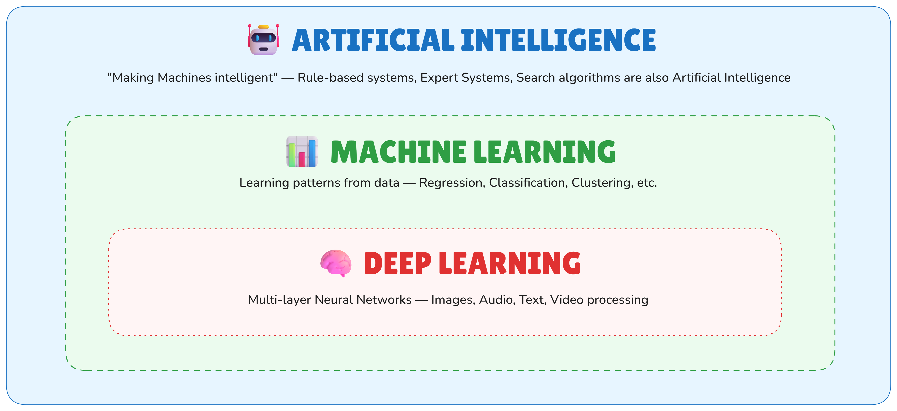
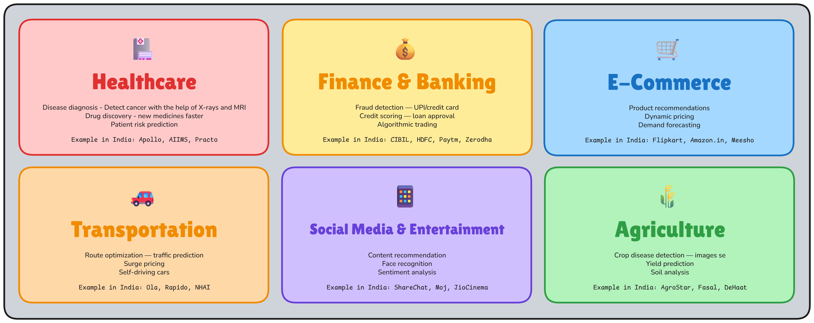
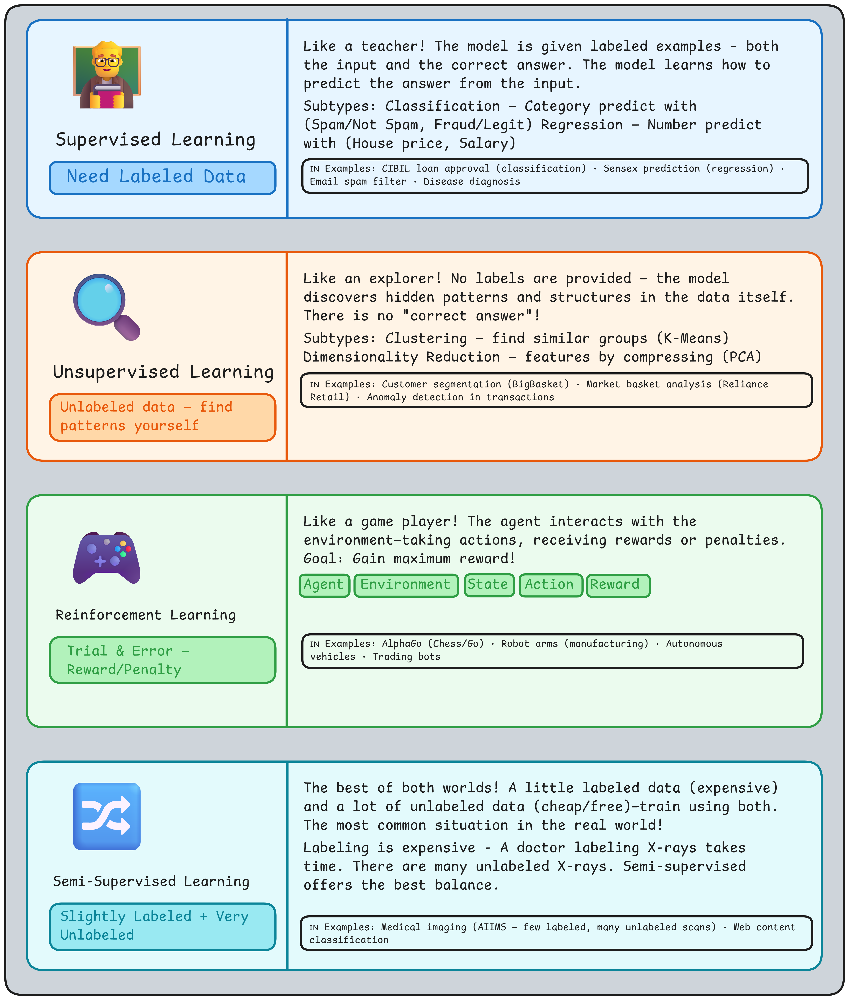
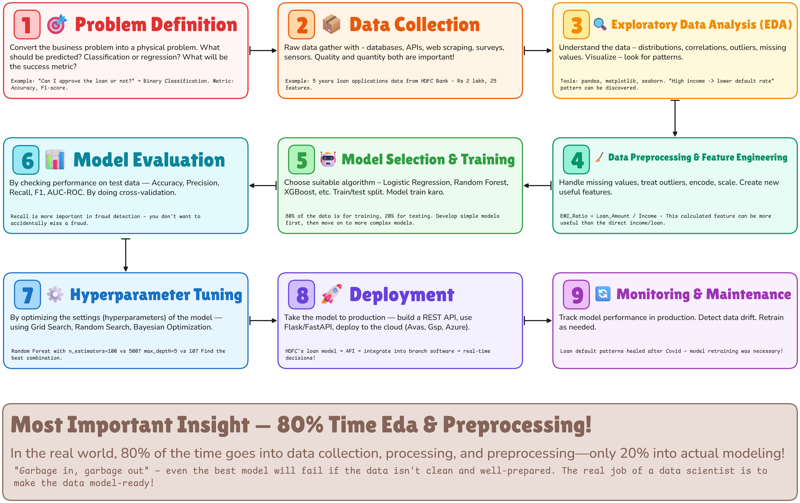
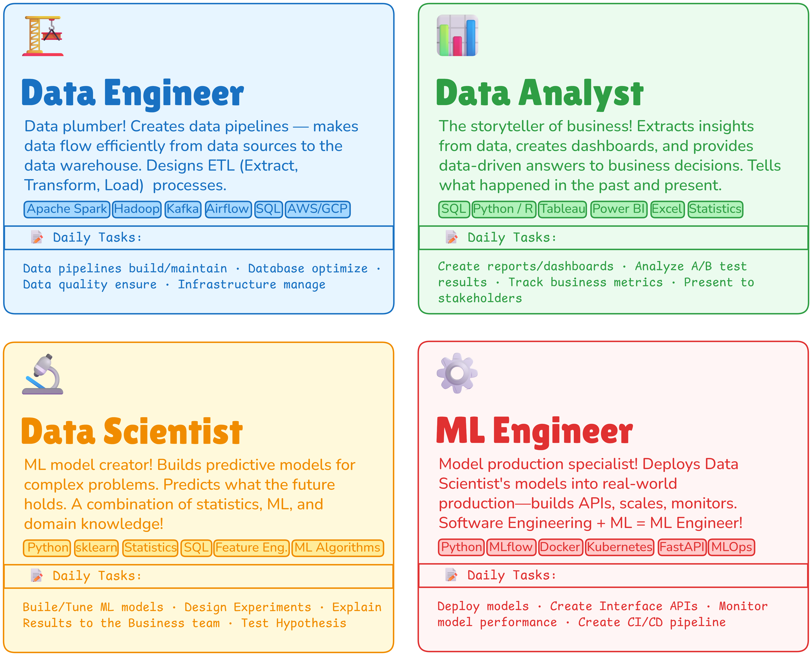

# What is Machine Learning?
## Definition - Arthur Samuel (1959)
To *understand/guide* a **computer** about perform certain work **without explicitly programming**.
## Modern Definition - Tom Mitchell (1998)
A computer program is said to learn from **Experience E** with respect to **Task T** and **Performance P** - if P on T improves with E.
# Traditional Programming vs Machine Learning

| Feature   | Traditional Programming                                                      | Machine Learning                                    |
| --------- | ---------------------------------------------------------------------------- | --------------------------------------------------- |
| Input     | Data + Rules (manually written)                                              | Data + Answers (examples)                           |
| Output    | Answers                                                                      | Rules (learned automatically)                       |
| Example   | `if price > 50L -> premium` `if age < 30 -> young`                         | "High price + large area + good location = premium" |
| Problem   | There could be millions of rules - It's impossible to write everything down! | *None*                                              |
| Advantage | *None*                                                                       | Millions of patterns are learned automatically!     |
# AI vs Machine Learning vs Deep Learning
## Difference in one line:
- `AI` = The biggest umbrella - making machines “intelligent,” no matter what technique you use.
- `ML` = A subset of AI - teach machines *from data*.
- `DeepLearning` = A subset of ML - using neural networks, especially for unstructured data (images, audio, text)
## Venn Diagram

## Comparison table

| Feature             | AI                  | Machine Learning                 | Deep Learning                      |
| ------------------- | ------------------- | -------------------------------- | ---------------------------------- |
| Data needed         | Rules or data—both  | Structured data — thousands rows | Huge data — millions of examples   |
| Feature engineering | Manual rules        | Have to create manual features   | Automatic — self-learns features   |
| Compute power       | Low–Medium          | Medium                           | Very High — GPUs are needed        |
| Interpretability    | High                | Medium                           | Low — "Black Box"                  |
| India example       | IRCTC search engine | CIBIL credit scoring             | Google Lens, Zomato food detection |
# Real-Life Machine Learning Applications

# Types of Machine Learning - All Three Flavours!
## Three Main Categories
ML algorithms are classified based on the type of training data and feedback - Supervised, Unsupervised, and Reinforcement Learning. There's also a fourth: Semi-Supervised!

# MLDLC — Machine Learning Development Life Cycle
## What is MLDLC?
MLDLC = How an ML project is built from start to finish – each step has a defined order. It's an iterative process – not just once, but repeatedly looped until the results are satisfactory!

# Data Science Job Roles — Choose Your Career Path!

| MLDLC Step      | Data Engineer | Data Analyst | Data Scientist | ML Engineer |
| --------------- | ------------- | ------------ | -------------- | ----------- |
| Data Collection | Primary       | Supports     | —              | —           |
| EDA & Analysis  | —             | Primary      | Primary        | —           |
| Preprocessing   | Supports      | —            | Primary        | —           |
| Model Building  | —             | —            | Primary        | Supports    |
| Deployment      | —             | —            | —              | Primary     |
| Monitoring      | Supports      | Supports     | —              | Primary     |
| Reporting       | —             | Primary      | Supports       | —           |
