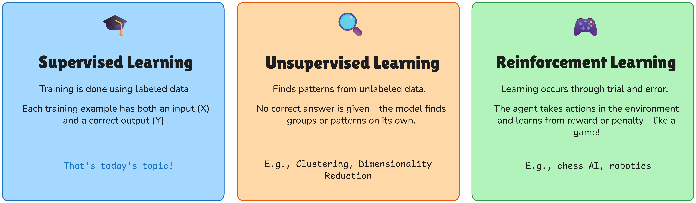
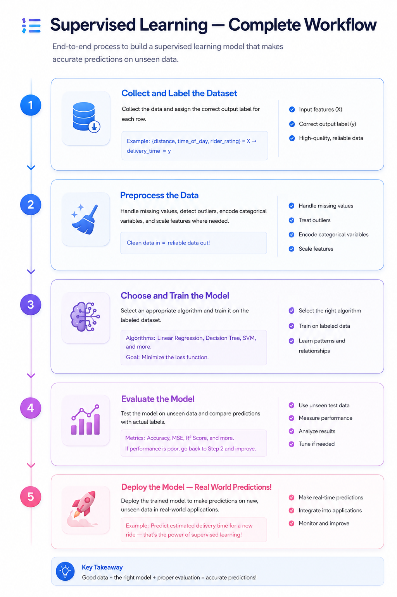
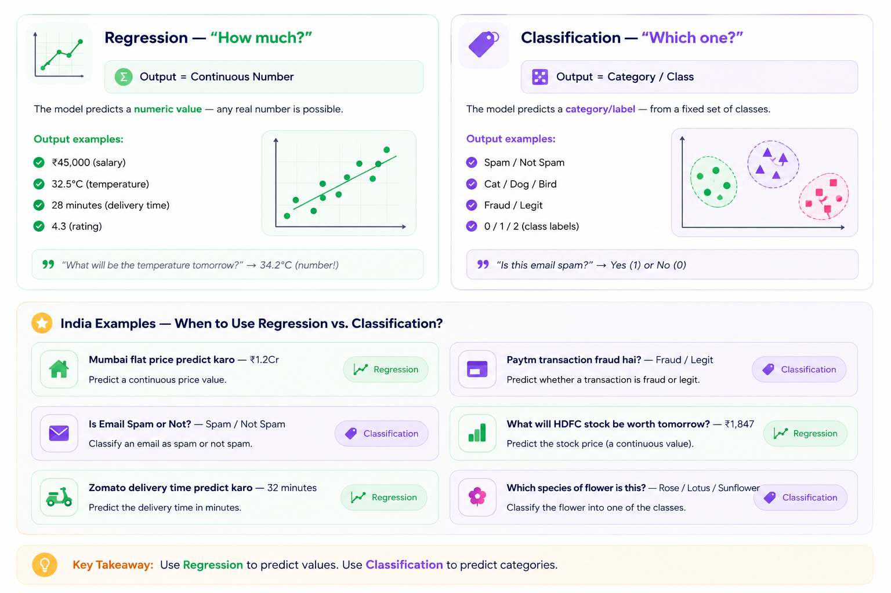
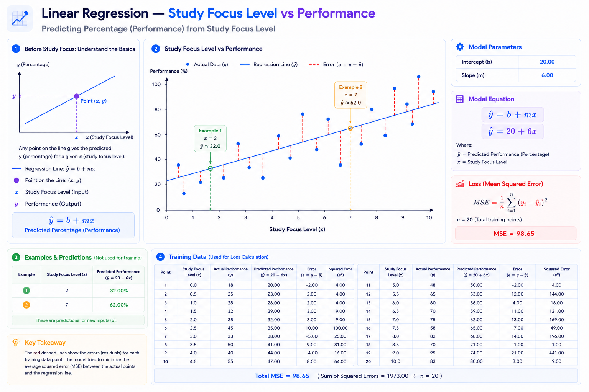
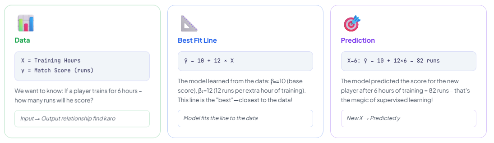
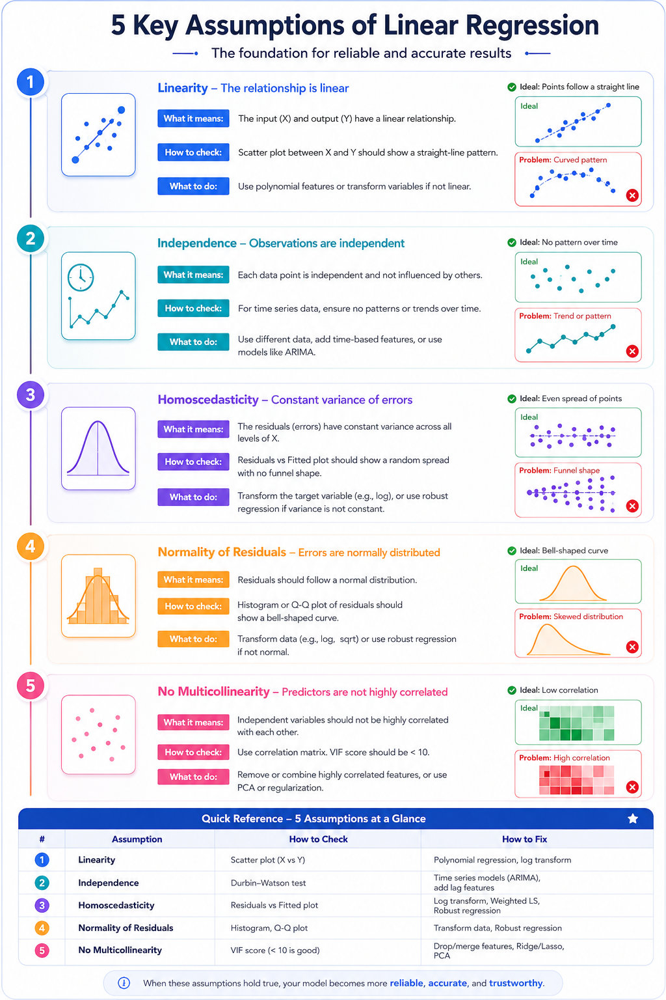
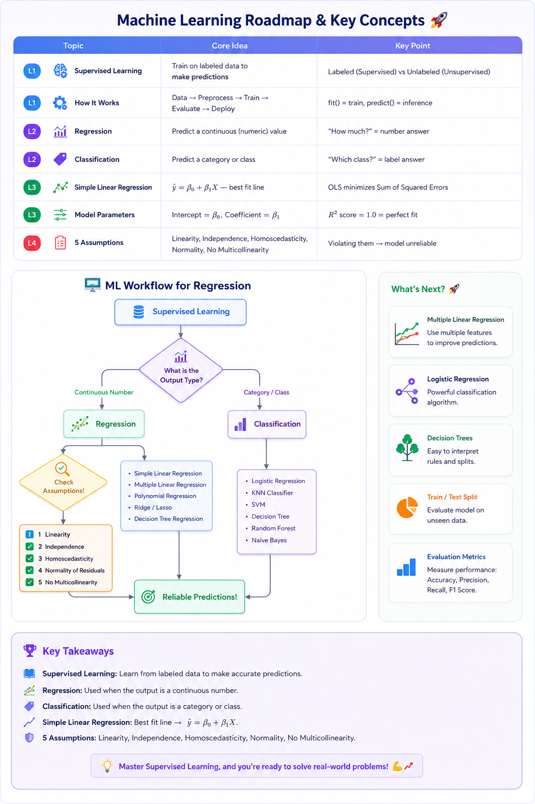

# Supervised Learning — Learn From Teacher!
## Core Definition — In One Line
**Supervised Learning** = When a model `is trained on labeled data` —that is, the correct output is given along with the input—so that it can make its own predictions for new inputs.
### 3 Big Types of Machine Learning

## Real India Analogy — How do you learn in school?
Supervised Learning is very easy to understand – think of it like school!

- **Teacher (Supervisor)** = gives labeled data  
- **Student (Model)** = learns patterns from examples  
- **Homework (Training)** = model is trained on labeled examples  
- **Exam (Prediction)** = model answers new and unseen problems
**Concrete Example:** If we give the model data of 1000 IPL matches – _pitch conditions, team, weather = Input X_ and _match result = label y_ – then the model will learn to predict future matches!
## Linear Algorithm
1. Linear Regression
	- SLR - Single Linear Regression
	- MLR - Multiple Linear Regression
	- PR - Polynomial Regression
# Supervised Learning - How it works

# Regression vs Classification – Identify by looking at the output!
## Core Idea — Remember One Rule
Supervised Learning is divided into two tasks – look at the type of output:
**Regression** = output is a `continuous` number → "how much?" or "what value?"  
**Classification** = output is a `category/class` → "which?" or "yes or no?"
## Graphical Representation

# Regression vs Classification - Algorithms & Metrics
| Feature                 | Regression                                                                                                    | Classification                                                                                                  |
| ----------------------- | ------------------------------------------------------------------------------------------------------------- | --------------------------------------------------------------------------------------------------------------- |
| **Output Type**         | Continuous numerical value (e.g., price, salary, temperature)                                                 | Discrete category or label (e.g., Yes/No, Spam/Ham)                                                             |
| **Question Type**       | “How much?” or “What is the value?”                                                                           | “Which category?” or “Yes or No?”                                                                               |
| **Common Algorithms**   | Linear Regression, Polynomial Regression, Ridge, Lasso, SVR, Decision Tree Regressor, Random Forest Regressor | Logistic Regression, KNN, SVM, Decision Tree Classifier, Random Forest Classifier, Naive Bayes, Neural Networks |
| **Evaluation Metrics**  | MSE, RMSE, MAE, R² Score                                                                                      | Accuracy, Precision, Recall, F1-Score, ROC-AUC                                                                  |
| **Example**             | Predicting house price ($250,000)                                                                             | Predicting whether an email is Spam or Not Spam                                                                 |
| **Scikit-learn Import** | `LinearRegression()`                                                                                          | `LogisticRegression()`                                                                                          |
## Logistic Regression — Name: Regression, but work: Classification!
An interesting confusion: **Logistic Regression** is called "Regression" but it is a Classification algorithm!  
→ Output is 0 or 1 (binary class) – not a continuous number  
→ Internally uses an S-shaped curve (sigmoid function) which gives probability in 0–1  
→ Decide on threshold (usually 0.5): ≥ 0.5 → Class 1, < 0.5 → Class 0  
_This is a classic confusion – don't go by the name, look at the output type!_
# Simple Linear Regression - Predict with a straight line!
## Core Idea — In One Line
**Simple Linear Regression** = Predict a continuous output (y) from an input feature (X) — `by drawing a straight line`!
Equation: **y = mx + c**   or in ML   , **ŷ = β₀ + β₁X**
Where: β₀ = intercept (where the line starts), β₁ = slope (how steep the line is).  
_Model training task = Finding the best β₀ and β₁ values!_
## Graphical Representation (More understanding)

## Intuition — IPL Batting Average Example

## How to Find the "Best Line" Model? — Least Squares
The model uses **Ordinary Least Squares (OLS)**  
- A mathematical trick: → For each point **Residual($e_i$) = Actual y($y_i$) − Predicted y($\hat{y}_i$)** Find (how much is wrong)  
- Square all residuals($e$) and add them = **Sum of Squared Errors ($SSE$) → The line which** _minimizes_  
SSE — is the best fit line! _Exactly the same thing happens in training — keep adjusting β₀ and β₁ until SSE is minimum._
## Simple vs Multiple Linear Regression
**Simple Linear Regression:** Only _1_ input feature $X$ → $\hat{y}=\beta_0+\beta_1X$ 
**Multiple Linear Regression:** *Multiple* input features $X_1, X_2, X_3...$ → $\hat{y}=\beta_0+\beta_1X_1+\beta_2X_2+\beta_3X_3...$
# Assumptions of Linear Regression — Remember 5 Rules!
## Why are Assumptions important?
Linear Regression only works reliably when the data satisfies certain conditions—these are called **assumptions**.
If these assumptions are violated, predictions will be unreliable, coefficients will be wrong, and confidence intervals will be meaningless!  _This is a must-ask question in interviews—memorize all 5!_

# Final Summary & Your Supervised Learning Roadmap

# Coding File of this Lecture
[Coding-files/lec_1.2.ipynb](../Coding-files/lec_1.2.ipynb)
